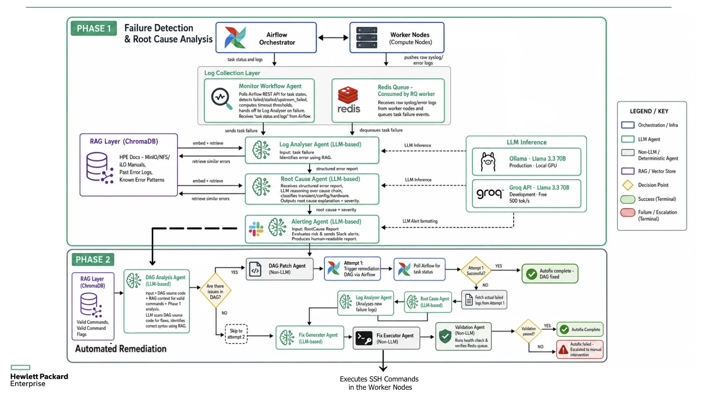

# AI-ENABLED BUILD WORKFLOW FOR INFRASTRUCTURE DEPLOYMENT

<p align="center">
  <a href="https://github.com/kernelops/hpe-pcai-ai-workflow/raw/dev/HPE_CPP_Demo_Video.mp4">
    
  </a>
</p>

---

An end-to-end AIOps platform that monitors Airflow-driven infrastructure deployments, performs autonomous failure analysis, and executes automated remediation — all from a single dashboard.

| Layer | Tech |
|-------|------|
| **Orchestration** | Apache Airflow (Docker Compose) |
| **Agent Pipeline** | LangGraph multi-agent graph |
| **Knowledge Retrieval** | ChromaDB-backed RAG with HPE knowledge base |
| **Backend API** | FastAPI (deployment control, log streaming, agent proxy) |
| **Frontend** | React + Vite |
| **Task Queue** | Redis + RQ (passive HPC telemetry) |
| **LLM** | Groq (cloud) - Llama 3.3 70B|

## Architecture

<p align="center">
  
</p>

The platform operates in **two phases**:

### Phase 1 — Failure Detection & Root Cause Analysis

Airflow orchestrates infrastructure deployment across worker nodes. On task failure, the log collection layer kicks in:

1. **Monitor Workflow Agent** — polls the Airflow REST API for task states, detects failures, computes timeout thresholds, and hands off to the Log Analyser. A **Redis queue** (consumed by an RQ worker) receives raw syslog/error logs from worker nodes and queues task failure events.
2. **Log Analyser Agent** *(LLM-based)* — receives the task failure, identifies errors using RAG (ChromaDB with HPE docs, MinIO/NFS/iLO manuals, past error logs, and known error patterns). Produces a structured error report.
3. **Root Cause Agent** *(LLM-based)* — reasons over the error report, classifies the cause as transient/config/hardware, and outputs root cause explanation + severity.
4. **Alerting Agent** *(LLM-based)* — evaluates risk, sends Slack alerts, and produces a human-readable report.

**LLM Inference** is powered by Groq API (Llama 3.3 70B, free developer tier at 500 tok/s). 

### Phase 2 — Automated Remediation

Phase 2 uses a two-attempt strategy:

**Attempt 1 — DAG-level fix:**
1. **DAG Analysis Agent** *(LLM-based)* — takes the DAG source code + RAG context + Phase 1 analysis, scans for logic flaws, and identifies correct syntax using RAG.
2. If issues are found in the DAG → **DAG Patch Agent** *(Non-LLM)* — patches the DAG source via AST rewriting, triggers a remediation DAG run via Airflow, and polls for task status.
3. If Attempt 1 succeeds → **Autofix complete — DAG fixed.**
4. If Attempt 1 fails → fetches actual failed logs from the remediation run and proceeds to Attempt 2.

**Attempt 2 — Infrastructure-level fix (SSH):**
1. **Log Analyser Agent** re-analyzes the new failure logs from Attempt 1.
2. **Root Cause Agent** re-classifies the updated failure.
3. **Fix Generator Agent** *(LLM-based)* — produces OS-level SSH fix commands.
4. **Fix Executor Agent** *(Non-LLM)* — connects via SSH to worker nodes and executes the fix commands.
5. **Validation Agent** *(Non-LLM)* — runs post-fix health checks and verifies the Redis queue.
6. If validation passes → **Autofix complete.** If not → **Escalated to manual intervention.**

### Service Map

| Service | Port | Description |
|---------|------|-------------|
| **Airflow UI** | 8080 | DAG management and task logs (admin: `airflow` / `airflow`) |
| **RAG Service** | 8002 | ChromaDB retrieval + HPE knowledge base |
| **Agent API** | 8001 | LangGraph agent pipeline endpoints |
| **Backend API** | 8000 | Deployment control, log streaming, agent ops proxy |
| **Frontend** | 5173 | React dashboard |
| **Redis** | 6379 | Task queue broker |

## Repository Layout

```text
hpe-pcai-ai-workflow/
├── agents/                  # LangGraph agents (workflow_graph.py is the main graph)
├── airflow/                 # Docker Compose stack, DAGs, and Airflow config
├── api/                     # Agent Ops API (FastAPI, port 8001)
├── backend/                 # Deployment backend API (FastAPI, port 8000)
├── common/                  # Shared config (config.py) and Pydantic models
├── frontend/                # React + Vite UI
├── rag/                     # RAG engine, knowledge base, ChromaDB retrieval
├── sample_logs/             # Sample failure logs for testing the agent pipeline
├── docs/                    # Technical documentation
├── start.sh                 # Unified launcher (start/stop all services)
├── main.py                  # CLI entry point for running the LangGraph pipeline
├── .env.example             # Environment variable template
├── requirements.txt         # Python dependencies
├── architecture.png         # System architecture diagram
├── HPE_CPP-3_Final_Presentation_Slides.pdf
└── HPE_CPP_Demo_Video.mp4
```

## Prerequisites

- **Linux** development environment (Ubuntu 20.04+ recommended)
- **Python 3.10+** with `venv`
- **Node.js 18+** and npm
- **Docker Engine** with Docker Compose v2
- At least one reachable Linux VM or host with SSH enabled (for deployment targets)

### Environment Variables

Copy the template and fill in your keys:

```bash
cp .env.example .env
```

Required keys:

| Variable | Purpose |
|----------|---------|
| `GROQ_API_KEY` | LLM inference via Groq (or use Ollama locally) |
| `AIRFLOW_FERNET_KEY` | Airflow encryption key |
| `AIRFLOW_SECRET_KEY` | Airflow webserver secret |

## One-Time Setup

### 1. Clone the repository

```bash
git clone <your-repo-url>
cd hpe-pcai-ai-workflow
```

### 2. Create and activate a Python virtual environment

```bash
python3 -m venv .venv
source .venv/bin/activate
```

### 3. Install Python dependencies

```bash
pip install -r requirements.txt
```

### 4. Install frontend dependencies

```bash
cd frontend && npm install && cd ..
```

## Running the Platform

### Start all services

```bash
./start.sh
```

This single command starts **all 7 services** in the correct order:

1. Airflow stack (Docker Compose — scheduler, webserver, worker, Redis, Postgres)
2. RAG Service (port 8002)
3. Agent API (port 8001)
4. Backend API (port 8000)
5. RQ Worker (HPC error log queue)
6. React Frontend (port 5173)

The script waits for Airflow to be healthy, unpauses the deployment DAG, and prints a summary with all URLs.

Service logs are written to `.service_logs/`.

### Stop all services

```bash
./start.sh --stop
```

This cleanly stops all Python services, the frontend, and tears down Airflow Docker containers.

### Fresh start (clean slate)

If you need to start completely fresh (wipe Airflow database, volumes, and all state):

```bash
cd airflow
docker compose down -v
cd ..
./start.sh
```

> **Note:** `docker compose down -v` removes all Airflow volumes including the metadata database, DAG history, and logs. Use this when you want a completely clean environment.

### Skip Airflow

If Airflow is already running or you're working on non-Airflow components:

```bash
./start.sh --no-airflow
```

## Quick Verification

Once all services are up, verify from a separate terminal:

```bash
# RAG Service
curl http://127.0.0.1:8002/health

# Agent API
curl http://127.0.0.1:8001/health

# Backend API
curl http://127.0.0.1:8000/

# Airflow API
curl -u airflow:airflow http://127.0.0.1:8080/api/v1/dags/deployment_workflow/details
```

## Using the Platform

### 1. Add worker nodes

Open the frontend at `http://localhost:5173` and navigate to **Worker Nodes**.

For each target VM, enter:
- IP address
- SSH username
- SSH password

### 2. Validate SSH connectivity

Go to **SSH Validation** and click **Run SSH Health Check**.

| Status | Meaning |
|--------|---------|
| `PASS` | Node is reachable and SSH is open |
| `REFUSED` | Host is reachable but SSH is not listening on port 22 |
| `TIMEOUT` | Routing, firewall, or network path issue |

### 3. Start a deployment

Go to **Deployment** and click **Start Infrastructure Deployment**.

The platform will:
- Trigger the Airflow DAG with your worker node credentials
- Stream live combined logs from all tasks
- Display task progress in the **Workflow Monitor**
- Automatically trigger Agent Ops on failure

### 4. Review failure analysis (Phase 1)

On a failed run, open **Agent Ops** to inspect:
- Log analysis output and error classification
- Root cause reasoning and severity
- Alerting output and remediation guidance
- RAG-retrieved similar patterns from the HPE knowledge base

### 5. Apply autofix (Phase 2)

Click **Apply Autofix** to trigger the hybrid remediation pipeline:

- **Attempt 1 (DAG Patch):** Analyzes the DAG source code, detects logic errors, and patches via AST rewriting
- **Attempt 2 (SSH Fix):** Generates OS-level fix commands, connects via SSH to worker nodes, executes fixes, and runs validation

The autofix status and results are displayed in real time on the dashboard.

## CLI — Running the Agent Pipeline Directly

You can test the full LangGraph pipeline against sample logs without the UI:

```bash
# Phase 1 only (analysis + alerting)
python main.py

# Phase 1 + Phase 2 (analysis + autofix)
python main.py --autofix
```

## RAG Query Strategy

The RAG service builds structured queries combining:

- Airflow `task_id` and domain hints (`minio`, `nfs`, `postcheck`)
- Parsed `error_type` and `error_message`
- Raw log evidence (command text, keywords like `curl`, `exportfs`, `connection refused`, `timed out`)

This ensures retrieval is specific to the failing task and aligned with the HPE knowledge base contents.

## Troubleshooting

### DAG does not start

```bash
cd airflow
docker compose ps
docker compose exec airflow-webserver airflow dags list | grep deployment_workflow
```

If the DAG is paused, unpause it:

```bash
docker compose exec airflow-webserver airflow dags unpause deployment_workflow
```

### Frontend shows zero nodes

Worker nodes are stored in-memory. If the backend restarts, re-add nodes from the UI.

```bash
curl http://127.0.0.1:8000/nodes
```

### SSH shows REFUSED

SSH is not listening on port 22 on the target VM:

```bash
# On the target VM:
sudo systemctl start ssh
sudo systemctl enable ssh
ss -tuln | grep :22
```

### No live logs appear

Check Airflow task logs exist:

```bash
cd airflow
find logs -maxdepth 6 -type f | tail
docker compose logs --tail=100 airflow-scheduler
```

### RAG returns 500

Restart with forced local embeddings:

```bash
source .venv/bin/activate
RAG_FORCE_LOCAL_EMBEDDINGS=1 python -m uvicorn rag.main:app --host 0.0.0.0 --port 8002
```

### Agent Ops shows blank RAG Solution

- Verify the RAG service is running: `curl http://127.0.0.1:8002/health`
- Verify the Agent API is running: `curl http://127.0.0.1:8001/health`
- The failure may not match any knowledge base entry

## Presentation

📄 [Final Presentation Slides (PDF)](HPE_CPP-3_Final_Presentation_Slides.pdf)

## Development Notes

- Airflow runs locally through Docker Compose and is not production hardened
- Worker node persistence is in-memory only (resets on backend restart)
- Local RAG fallback mode is supported for offline development via `RAG_FORCE_LOCAL_EMBEDDINGS=1`
